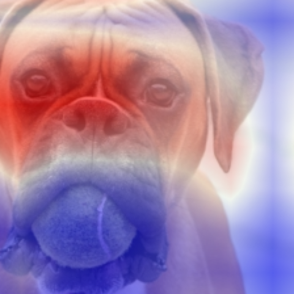
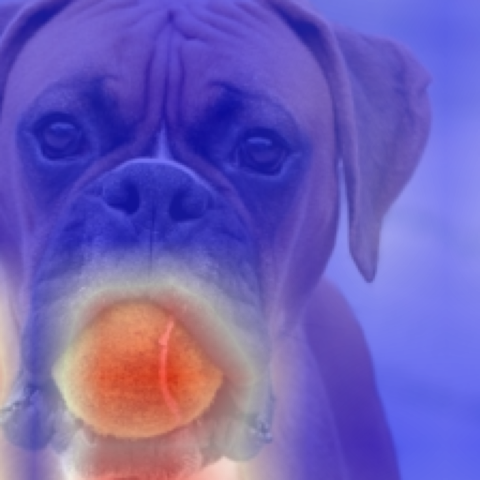

# L2-CAF: A Debugger Neural Network
(ECCV2020) Official PyTorch implementation of **A Generic Visualization Approach for Convolutional Neural Networks**

[Paper](https://arxiv.org/abs/2007.09748) | [1 Min Video](https://youtu.be/W4xaKQlPEl0) | [10 Mins Video](https://youtu.be/Wpw3ewSvnFE)

The goal of this PyTorch implementation is to provide a simple, readable, and fast implementation for L2-CAF. If you have an idea to make this simpler, please let me know!

L2-CAF does not require any finetuning or specific layers. It is easy to integrate L2-CAF in various network architectures. 

## Sample Visualization 
L2-CAF cls-specific using ResNet50

|     |   |
|---|---|
|   |   |

## Requirements

* Python 3+ [Tested on 3.7]
* PyTorch 1.X [Tested on torch 1.6.0 and torchvision 0.6.0]


## Usage example
The `class_oblivious.py` presents the class oblivious variant of L2-CAF, while `class_specific.py` presents the class specific variant of L2-CAF.

Both `python class_oblivious.py` or `python class_specific.py` will use the default hard-coded hyperparameters.

You can override the default hyperparameter from the cmd line, e.g., `python class_specific.py --input_img='dog_butterfly.jpg' --cls_logits='207,323'`. Check `config.base_config.Config` to know more about L2-CAF parameters.


### MISC Notes
* The L2-CAF is originally implemented in [TensorFlow](https://github.com/ahmdtaha/constrained_attention_filter). I hope this PyTorch implementation raises awareness of L2-CAF, this cool visualization tool  :)
* I noticed that visualization heatmaps are consistent across different TensorFlow models. In contrast, the output heatmaps from different PyTorch models seems inconsistent. This means the cls-oblivious heatmaps generated from ResNet50 and GoogleNet are significantly different. It is not required that heatmaps be consistent between different architecttures. Yet, I am surprised that there is a difference in behaviour between Tensorflow and PyTorch architectures.
* This PyTorch implementation visualizes attention of the last conv layer only. While L2-CAF can visualize attention in intermediate layers, I did not support this feature to keep the code simple. Yet, please note that the TensorFlow implementation supports intermediate layer visualization. 

### TODO LIST
* Support more architectures

## Release History
* 1.0.0
    * First commit Vanilla L2-CAF on DenseNet169, GoogleNet, and ResNet50 on 16 May 2021


### Citation
```
@inproceedings{taha2020generic,
title={A Generic Visualization Approach for Convolutional Neural Networks},
author={Taha, Ahmed and Yang, Xitong and Shrivastava, Abhinav and Davis, Larry},
booktitle={Proceedings of the European Conference on Computer Vision (ECCV)},
year={2020}
}
```
